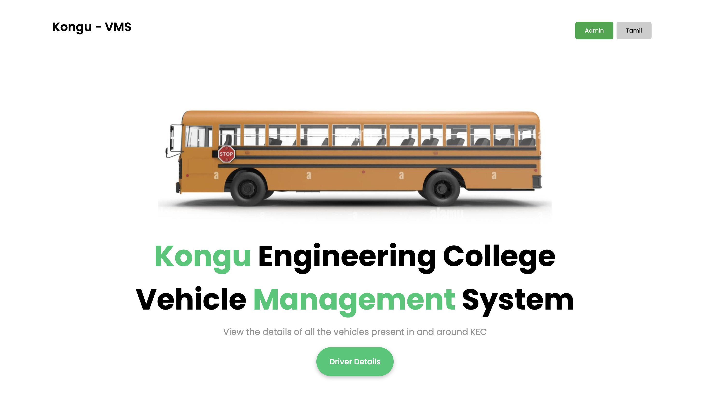

# Vehicle Management System

## Overview

• As a part of Web-App event conducted by 'EHORYZON2024' we developed a Vehicle Management System for our college vehicles with a feature of notifying the drivers and VMS admin about next service date via SMS.

## Project Details

- **Project Type:** Team Project
- **Role:** Team Leader, Full stack Developer

## Links

- [LinkedIn Project Update](https://www.linkedin.com/feed/update/urn:li:activity:7190759607982583808/)
- [GitHub Repository](https://github.com/Karthick1242004/Cognissance)
- [Hosted Link](https://kec-vms.vercel.app/)

